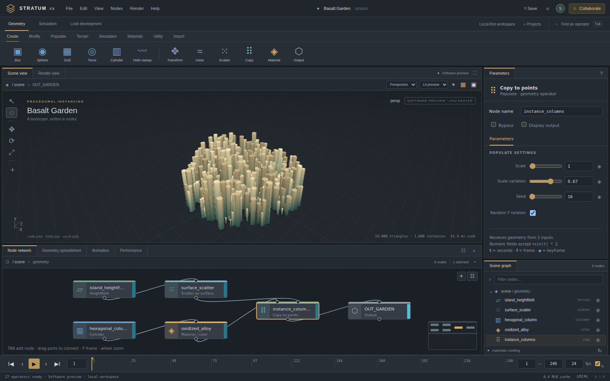

# Stratum FX

**A dependency-free procedural 3D studio for the browser.** Original branding, editable node graphs, instanced rendering, reusable JavaScript packages, and a self-hosted team backend. Version **0.1.0**.



> This is a working, bounded implementation, **not full Houdini feature/UI/file-format parity and not a production-qualified replacement**. Native WebGPU and WebGL2 renderers are implemented. The browser available for this release did not expose either GPU API, so browser qualification covers the explicitly labeled software fallback. See [scope](docs/SCOPE.md) and [test report](docs/TEST_REPORT.md).

## Website and editor

- **Website:** https://wieslawsoltes.github.io/StratumFX/
- **Studio:** https://wieslawsoltes.github.io/StratumFX/app/
- **Standalone app:** https://wieslawsoltes.github.io/StratumFX/StratumFX.html
- **Repository:** https://github.com/wieslawsoltes/StratumFX

GitHub Pages runs the local-first editor, examples and documentation. Accounts and
shared projects require the included Node/SQLite server; GitHub Pages does not run
that backend. See [deployment](docs/DEPLOYMENT.md) for builds and self-hosting.

## Run

Use Node.js **22.13 or newer**; this release was exercised with **22.16.0**. There are **no runtime dependencies to install**.

```sh
git clone https://github.com/wieslawsoltes/StratumFX.git
cd StratumFX
node server/index.js
```

Open **http://localhost:4173/** for the website or **http://localhost:4173/app/** for the studio. The server creates `.data/stratum.sqlite`. Keep that directory private and persistent. The environment example is documentation, not an automatically loaded dotenv file.

### Other launch modes

- **Single file:** open `dist/StratumFX.html`. The editor, procedural engine, worker, and renderer are embedded; no CDN is required. Local file/browser policy can restrict GPU and browser storage. Serving over localhost is more reliable. Team projects require the Node backend.
- **Static website:** serve the contents of `dist/` over HTTPS or localhost. It contains `index.html`, the studio, packages, docs, examples, and downloads. Static hosting alone does **not** provide accounts or team collaboration. The source archive deliberately does not contain a recursive copy of itself: run `python scripts/release.py --site-download` after building/packing to regenerate the homepage source-download link. The separate website ZIP already contains that download.
- **Container:** `docker compose up --build`. Open localhost:4173. Docker execution was not available for release qualification; these files are deployment templates.

WebGPU requires a suitable browser/driver and a secure context. The viewport tries WebGPU, then WebGL2, then an explicitly labeled CPU rasterizer. These backends do not have identical visual features or performance.

## Working capabilities

| Area | Included in this release |
| --- | --- |
| Procedural geometry | Typed-array triangle meshes, normals, UV buffers, colors, affine transforms, hardware-instancing data, bounds, subdivision, smoothing, surface scattering and instancing |
| Operator network | 27 operators, validated DAGs, cached incremental cooking, worker execution, safe expressions, editable wires/ports, node selection, pan/zoom, minimap, output flags, bypass, undo/redo |
| Rendering | Native WebGPU instancing, GGX-based material shading, directional shadow map, 4× MSAA; simplified WebGL2 fallback; CPU rasterizer fallback; perspective/orthographic cameras, ray/BVH picking, shaded/wireframe/normal/unlit views |
| Editing | Schema-generated parameter controls, numeric expressions, translate/rotate/scale handles, graph shelf and search, linear/step scalar keyframes, timeline playback, geometry spreadsheet and cook statistics |
| Simulation studies | Deterministic ballistic particles, position-based cloth with a fixed sphere/floor collider, and discrete equal-mass sphere dynamics. These are CPU models, not fluid/volume/general-body solvers |
| Files | Native JSON projects; a documented OBJ import/export subset; binary STL, geometry CSV and viewport PNG export |
| Persistence | IndexedDB local projects/checkpoints and SQLite team projects, operation history, and checkpoints |
| Collaboration | Accounts, cookie sessions, owner/editor/viewer roles, expiring invitation codes, SSE presence and edits, optimistic pending operations, revision recovery, retry deduplication and checkpoint restoration |

Seven editable studies ship with the app: Basalt Garden, Kinetic Lattice, Highland Study, Wind / Cloth Study, Particle Fountain, Rigid Rain, and Helical Sculpture. A blank document is also available. Names in example menus are presentation labels; operator definitions remain independently reusable.

## Reusable packages

All packages are built without an application runtime or third-party dependencies. ESM, browser-global bundles, declarations, source and MIT licensing are included. **The npm scope is a proposed local package namespace; nothing was published to npm.**

| Package | Public surface |
| --- | --- |
| `@stratum-fx/geometry` | `Mesh`, generators, math, deformation, instancing, interchange and bounded simulation models |
| `@stratum-fx/core` | `NodeRegistry`, `Engine`, `GraphStore`, operation validation, document schema, safe expressions and keyframe evaluation |
| `@stratum-fx/renderer` | `Viewport`, individual renderers, `OrbitCamera`, `MeshBVH` |
| `@stratum-fx/controls` | `<stratum-node-editor>`, `<stratum-parameter-editor>`, `<stratum-timeline>` and DOM events |
| `@stratum-fx/collaboration` | `ProjectDatabase` and `CollaborationClient`; the separately included server implements its HTTP/SSE protocol |

```sh
npm run build
npm run pack:all
# Produces artifacts/packages/stratum-fx-<name>-0.1.0.tgz
npm install /absolute/path/to/stratum-fx-core-0.1.0.tgz
```

Example, without the studio:

```js
import { Engine, createDocument, createNode } from '@stratum-fx/core';

const scene = createDocument('Independent engine');
const source = createNode('sphere');
scene.nodes.push(source);
scene.outputId = source.id;
const { mesh, stats } = new Engine().cook(scene, 1);
console.log(mesh.vertexCount, mesh.triangleCount, stats.ms);
```

Browser modules can import `./packages/core/dist/index.js` directly. A classic script `packages/core/dist/standalone.js` exposes `StratumCoreReady`, a promise resolving to `StratumCore`; await it before use. Each bundle includes its internal dependencies and is independently distributable. The shared mesh contract is structural, not tied to class identity between bundles. See [API](docs/API.md) and [standalone examples](examples/index.html).

## Editing guide

Open a study, select a node, and change its parameters. Changes recook the displayed output. Use the **Tab** palette or operator shelf to add nodes. Drag from an output port to an input port to connect; double-click a wire to disconnect. The output flag determines the geometry shown. A disconnected required input produces an error rather than fabricated geometry.

Orbit by dragging in the viewport, pan with right/middle drag or Shift-drag, and dolly with the wheel. **F** frames the scene. Select a Transform node and use the translate, rotate or scale tool to edit its parameters. Numeric parameters accept expressions beginning with `=`, such as `=sin(t)*2`. The safe expression language is intentionally not JavaScript or VEX.

Click the diamond beside a numeric parameter to key it; Shift-click removes that frame's key. Editing an already animated scalar inserts/updates the current frame. Scrub the timeline or play. Use the animation table for interpolation/key management. Undo/redo covers document operations; cameras and selection are view state.

File import/export and local project management are in the File menu. Export projects regularly; browser storage may be cleared by browser policy or the user. See [the complete guide](docs/guide.html).

## Team projects

Run the Node backend. Use **Collaborate** to register, create a team project, and generate an editor or viewer invitation. Teammates register/login on the **same origin** and join with the code. No email delivery or outside identity provider is configured.

The server validates atomic operation batches and assigns an increasing revision. Independent fields can merge; competing writes to the **same field use server-arrival order**. This is **not a CRDT or character-level coauthoring engine**. Undo emits compensating operations and can replace someone else's intervening edit to the same field. Offline batches remain in localStorage when permitted and retry on reconnection. Deleted dependencies or revoked permissions can reject a batch; preserve/export the local scene before destructive recovery. Pending-queue persistence in a normal browser origin was not qualified in this release's restricted browser.

Deploy one server process with a persistent SQLite volume. Use HTTPS, `NODE_ENV=production`, and the correct `ALLOWED_ORIGIN` behind a trusted reverse proxy. Disable response buffering for SSE. Do not expose `.data`, backup files or environment secrets. See [security/deployment](docs/SECURITY.md).

## Verification

```sh
npm run check
npm test
npm run build
npm run pack:all
# Optional browser checks; requires a separately installed Python Playwright + Chromium:
python tests/browser-smoke.py
```

The included browser report uses a standalone-document harness because the managed browser blocks all URL navigation. It exercises actual application code and actual geometry through the software renderer; it does not certify GPU drivers, IndexedDB or browser SSE behavior. HTTP/SSE/SQLite integration is tested separately over real loopback connections. See [test report](docs/TEST_REPORT.md) for exact results and untested areas.

## Repository

```
app/                 Plain HTML/CSS/JS studio
packages/            Five independently built libraries, declarations and source
server/              HTTP, SSE, authentication, ACLs and SQLite
site/                Original landing page and actual app screenshot
examples/            Independent package demonstrations and native scene files
docs/                Guide, API, scope, architecture and qualification
scripts/             Dependency-free bundler, build, pack, checks and backup
tests/               Node unit/integration tests and browser interaction checks
dist/                Ready-to-serve site and single-file application
artifacts/           Test evidence, screenshots and local package archives
```

The small bundler supports the repository's controlled static named ESM import/export patterns; it is not a general-purpose third-party JavaScript bundler. Builds do not transpile for old browsers.

## Boundaries and license

No HIP/HDA file compatibility, Houdini Engine API, VEX, Python integration, USD/Solaris, Alembic, OpenVDB, Pyro, FLIP/MPM fluids, general Vellum/rigid-body parity, rigging, native DCC docking, complete modeling/UV/texture pipelines, render farm, offline path tracer, or enterprise identity/compliance is implemented. Some basic categories above are represented by small-purpose models rather than corresponding commercial systems. UI is inspired by the familiar procedural-DCC workflow, **not pixel-identical UI parity**.

MIT licensed original implementation. No SideFX source, branding, proprietary assets or binaries are included. Houdini is referenced only to explain the requested workflow and compatibility boundaries. The name “Stratum FX” has not undergone trademark clearance. No public deployment or registry publication was performed.
